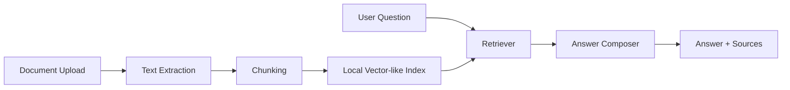

# Campus RAG Assistant

面向 AI 应用工程岗位的校园/企业知识库问答系统。项目目标是把“文档解析、切分、检索、引用回答、API 封装、前端演示”做成一个应届生能讲清楚、面试官能复现的完整作品。

## Features

- 上传 `.txt`、`.md`、`.pdf` 文档并建立本地索引
- 按 chunk 切分文档，记录来源文件和片段编号
- 根据问题检索 top-k 相关片段
- 返回带来源引用的回答，降低无依据回答
- 提供 FastAPI 接口：`GET /health`、`POST /documents`、`POST /ask`
- 提供 Streamlit 演示页，适合录制 3 分钟项目视频
- 无 API key 也能运行，后续可替换为真实 LLM 生成器

## Tech Stack

- Python 3.10+
- FastAPI + Uvicorn
- Streamlit
- Standard-library retrieval baseline
- Optional: pypdf for PDF parsing

## Quick Start

```powershell
python -m venv .venv
.\.venv\Scripts\Activate.ps1
pip install -r requirements.txt
python -m rag_app.cli ingest sample_docs\campus_policy.md
python -m rag_app.cli ask "学生如何申请奖学金？"
```

查看或清理本地索引：

```powershell
python -m rag_app.cli stats
python -m rag_app.cli reset
```

启动 API：

```powershell
uvicorn rag_app.api.main:app --reload --host 127.0.0.1 --port 8000
```

启动前端：

```powershell
streamlit run src\rag_app\ui\streamlit_app.py
```

如果使用源码目录运行时找不到包，请先执行：

```powershell
$env:PYTHONPATH="src"
```

## API

### `GET /health`

返回服务状态和当前已索引的 chunk 数。

### `POST /documents`

上传并索引一个文档。

Form-data:

- `file`: `.txt`、`.md`、`.pdf`

重新上传同名文档时，系统会先替换旧 chunk，避免 sources 出现重复结果。

### `POST /ask`

请求体：

```json
{
  "question": "学生如何申请奖学金？",
  "top_k": 3
}
```

响应体：

```json
{
  "answer": "...",
  "sources": [
    {
      "source": "campus_policy.md",
      "chunk_id": "campus_policy.md::0",
      "score": 0.42,
      "text": "..."
    }
  ]
}
```

## Architecture



## Resume Bullets

- 开发基于 FastAPI 的校园知识库 RAG 问答系统，支持 Markdown/TXT/PDF 文档上传、文本切分、相关片段检索和来源引用回答。
- 设计文档索引与问答 API，提供 `POST /documents`、`POST /ask`、`GET /health` 接口，并通过 Streamlit 前端完成可视化演示。
- 构建 20 条自测问答集，记录 top-k 检索命中、来源引用和接口耗时，用于迭代 chunk 参数与项目展示材料。

## Next Improvements

- 接入 OpenAI-compatible LLM 或本地模型，让回答更自然
- 替换检索 baseline 为 Chroma/FAISS + embedding model
- 增加用户登录、问答日志、后台管理页
- 增加 Dockerfile 和 GitHub Actions
